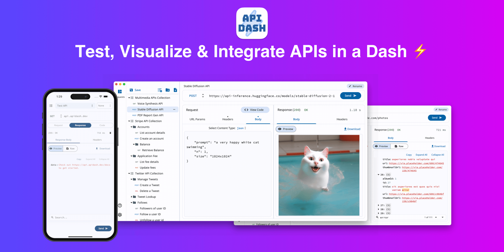

# API Dash ⚡️
### Please support this initiative by giving this project a Star ⭐️

API Dash is a beautiful open-source cross-platform API Client that can help you easily create & customize your API requests, visually inspect responses ([full list of supported mime-types](https://github.com/foss42/apidash?tab=readme-ov-file#mime-types-supported-by-api-dash-response-previewer)) and generate API integration code ([full list](https://github.com/foss42/apidash?tab=readme-ov-file#code-generators)) on the go.

